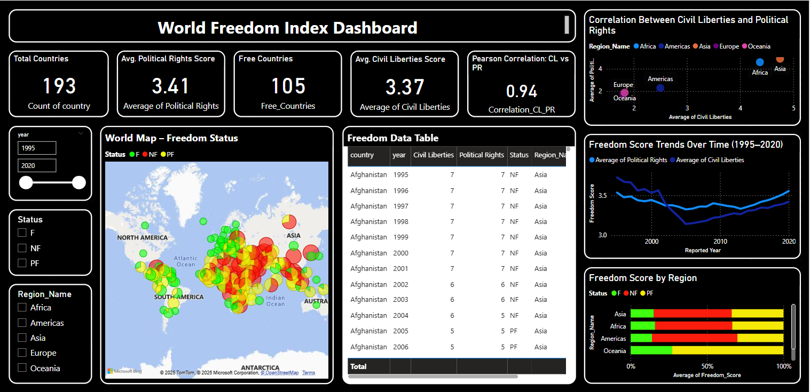

## 📌 **Business Problem**
In today’s complex geopolitical landscape, understanding the global distribution and evolution of freedom is more important than ever. Organizations, policymakers, and researchers need a clear, data-driven view of how civil liberties and political rights are progressing or regressing across the world. However, raw data alone is difficult to interpret without effective visualization. This project aims to bridge that gap.

## 🎯 **Objective of the Dashboard**
The core goal of this dashboard is to present a compelling and interactive visual narrative of the World Freedom Index. It enables:
- Clear comparison of freedom status (Free, Partly Free, Not Free) across regions and countries.
- Identification of trends in civil liberties and political rights over the years.
- Strategic insight for governments, NGOs, and global institutions to identify regions that require urgent attention.

## 📊 **Key Visuals and Descriptions**
**KPI Indicators**
- Total Countries Analyzed
- Average Civil Liberties Score
- Average Political Rights Score
- Free Countries Count
- Pearson Correlation (CL vs PR)
  
   -*Provides a quick glance at global coverage, scoring averages, and how civil liberties relate to political rights.*
  
**Clustered Bar Chart: Freedom Score by Region**

- Displays the distribution of "Free", "Partly Free", and "Not Free" countries across global regions, offering an easy-to-read comparison.

**Map View: World Freedom Status**

- An interactive map with color-coded markers for freedom classification:  
  🟢 Free 🟡 Partly Free 🔴 Not Free

**Scatter Plot: Correlation Between Civil Liberties & Political Rights**

- Highlights the strong correlation between civil liberties and political rights across regions.

**Line Chart: Freedom Score Trends Over Time (1995–2020)**

- Illustrates global freedom trends over time, showing changes in both civil liberties and political rights.

**Interactive Table: Country-Level Freedom Data**

- Enables detailed exploration by country, year, region, and status for further analysis.

## 💡 **Key Business Insights**
- Europe and North America consistently report the highest number of "Free" nations.
- Middle East & Sub-Saharan Africa have concerning concentrations of "Not Free" countries.
- Year-on-year trends show gradual improvement in some regions, while others exhibit freedom decline.
- This dashboard can empower decision-makers to formulate region-specific policies and promote human rights advocacy.

## 🗂️ **Project Files**
- `World_Freedom_Index_Analysis.pbix` – Power BI Dashboard File
- `World_Freedom_Index_Analysis.png` – Dashboard Screenshot

## 📷 Dashboard Preview

**Dashboard Description:**  
- Interactive Power BI dashboard tracking global freedom (1995–2020), comparing civil liberties vs. political rights across regions, highlighting key trends and strong correlations.

## 👩‍💼 **About the Creator**
Neha Thakur | Data Analyst | Passionate about transforming data into impactful stories.
